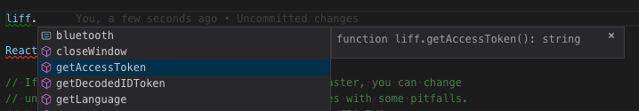

# liff-type

[](https://badge.fury.io/js/liff-type) [](https://github.com/microsoft/TypeScript)


Type definition for LINE Frontend Framework

### Installation

```
npm i -D liff-type
```

### Usage

In `.tsconfig`, add `liff-type` to `types` in `compilerOptions`

```
{
    "compilerOptions": {
        "types": ["liff-type"]
    }
}
```

In your code, you can access `liff` directly as global variable without window! 



### Versioning

Major and Minor Version are matched with LIFF SDK.

Patch is bug fixed or improvement.
